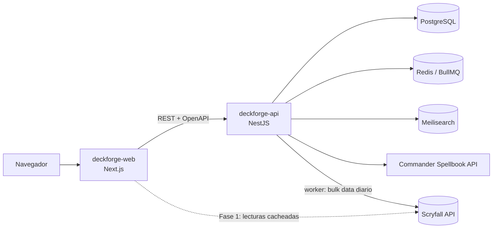

# DeckForge · Web

> **Nombre provisional.** Constructor de mazos de _Magic: The Gathering_ inspirado en Moxfield y Archidekt,
> centrado en la velocidad de edición, las animaciones fluidas y unas recomendaciones que expliquen el porqué.

**Estado:** Fase 3 completada: el editor de mazos (añadir, arrastrar entre zonas, paleta de comandos, agrupar y etiquetar, columnas a medida, vistas de texto, imágenes y pilas, guardado automático, estadísticas, validación, quick adds e historial de versiones) y su vista pública de solo lectura. En curso: Fase 4, el pulido de la experiencia, que empieza por los huecos que salieron al repasar la Fase 3. Después, Fase 5: la colección en cajas y el asistente que monta el mazo con tus propias cartas. Este README es el **guion de desarrollo**: cada fase se marca aquí según avanza.

## Índice

1. [Visión del producto](#1-visión-del-producto)
2. [Arquitectura y repositorios](#2-arquitectura-y-repositorios)
3. [Stack tecnológico](#3-stack-tecnológico)
4. [Estructura del proyecto](#4-estructura-del-proyecto)
5. [Pantallas](#5-pantallas)
6. [APIs de Magic: The Gathering](#6-apis-de-magic-the-gathering)
7. [Roadmap por fases](#7-roadmap-por-fases)
8. [Puesta en marcha](#8-puesta-en-marcha)
9. [Convenciones](#9-convenciones)
10. [Aviso legal](#10-aviso-legal)

---

## 1. Visión del producto

Una web donde los jugadores se registran, construyen y analizan sus mazos, descubren cartas nuevas,
reciben recomendaciones y comparten sus listas con la comunidad.

### Enfoque: Commander (EDH)

Commander es el formato más jugado de Magic y en DeckForge es **ciudadano de primera**: el resto de formatos se soportan,
pero las decisiones de producto se toman pensando en Commander.

- **El comandante manda.** Cada mazo gira alrededor de una carta. Su **identidad de color** (los colores de su coste de maná
  más los que aparezcan en el texto de sus habilidades) determina qué cartas son legales en ese mazo. Por eso el comandante
  se elige **antes** que nada y, a partir de ahí, filtra todas las búsquedas y sugerencias del mazo.
- **Cien cartas y una sola copia de cada una** (salvo tierras básicas), lo que cambia por completo las estadísticas y las
  probabilidades de robo respecto a los formatos de sesenta cartas.
- **Gran parte del mazo es casi obligatoria.** Rampa, robo de cartas, remoción y ciertas tierras se repiten en la inmensa
  mayoría de listas de esos colores. Montar esa base a mano, carta por carta, es el trabajo más repetitivo y aburrido de
  construir un mazo, y es justo lo que queremos eliminar.
- **Casi nadie construye desde cero: se construye con lo que hay en casa.** Quien juega tiene cajas de cartas y, al montar un
  mazo, el trabajo de verdad es acordarse de qué tiene y si encaja con el comandante. Si DeckForge sabe qué cartas tienes,
  puede responder eso él: "de tu colección, estos son los Ángeles blancos que entran en este mazo". Esa es la otra mitad del
  producto, y el motivo de la sección de colección y del asistente de construcción.

### Qué queremos mejorar respecto a Moxfield y Archidekt

| Área                  | Propuesta de DeckForge                                                                                                                                   |
| --------------------- | -------------------------------------------------------------------------------------------------------------------------------------------------------- |
| Edición               | Editor _keyboard-first_: paleta de comandos (`Ctrl+K`), añadir con `4 Lightning Bolt`, deshacer/rehacer y guardado automático.                           |
| Búsqueda              | Constructor visual de filtros **sincronizado** con la sintaxis de Scryfall (editas uno y se actualiza el otro).                                          |
| Versiones             | Historial del mazo con _diffs_ (qué entró y qué salió) y variantes de un mismo mazo.                                                                     |
| Análisis              | Estadísticas en vivo: curva, fuentes de color frente a requisitos, probabilidades de robo (hipergeométrica).                                             |
| Recomendación         | Sugerencias **explicadas**, combos detectados, alternativas por presupuesto y estimación del _bracket_ de Commander.                                     |
| Rendimiento           | Listas virtualizadas, UI optimista y transiciones suaves que respetan la opción "reducir movimiento".                                                    |
| **Colección**         | Inventario en cajas (qué tienes, en qué acabado y cuánto vale) y un asistente que monta el mazo **con tus propias cartas** según el comandante.          |
| **Quick adds**        | Sección del editor con las cartas casi obligatorias del comandante elegido: montar la base del mazo en unos pocos clics en lugar de buscarlas una a una. |
| **Commander primero** | Elegir comandante fija la identidad de color y filtra automáticamente búsquedas, sugerencias y validación de todo el mazo.                               |

---

## 2. Arquitectura y repositorios



| Repositorio       | Estado                | Responsabilidad                                                                                                     |
| ----------------- | --------------------- | ------------------------------------------------------------------------------------------------------------------- |
| **deckforge-web** | ✅ Este repositorio   | Interfaz, SSR/SEO de mazos y cartas públicas, BFF ligero (Route Handlers que hacen de proxy cacheado a Scryfall).   |
| **deckforge-api** | ✅ En marcha          | Autenticación, usuarios, mazos, colección, búsqueda de mazos, recomendaciones y worker de sincronización de cartas. |
| deckforge-recs    | 💭 A evaluar (Fase 7) | Solo si el motor de recomendaciones necesita ML en Python; si no, vive como módulo de `deckforge-api`.              |

**¿Por qué separar web y API?** El worker que sincroniza los _bulk data_ de Scryfall (cientos de MB al día) y el cálculo
de recomendaciones son procesos pesados con otro ciclo de despliegue y escalado que el frontend. El contrato entre ambos
es la especificación **OpenAPI** que publica la API; el frontend genera sus tipos con `openapi-typescript`.

---

## 3. Stack tecnológico

| Capa            | Tecnología                                    |
| --------------- | --------------------------------------------- |
| Framework       | Next.js 16 (App Router, Turbopack) + React 19 |
| Lenguaje        | TypeScript 5.9 (modo estricto)                |
| Estilos         | Tailwind CSS v4 (design tokens con `@theme`)  |
| Animaciones     | Motion (antes Framer Motion)                  |
| Estado servidor | TanStack Query 5                              |
| Estado cliente  | Zustand 5                                     |
| Interacción     | dnd-kit (arrastrar) · cmdk (paleta Ctrl+K)    |
| Validación      | Zod 4                                         |
| Calidad         | ESLint 9 + Prettier (plugin de Tailwind)      |

La justificación completa y las alternativas descartadas están en **[docs/TECH_STACK.md](docs/TECH_STACK.md)**.

---

## 4. Estructura del proyecto

```text
deckforge-web/
├── docs/
│   ├── ARCHITECTURE.md          # Capas, principios SOLID aplicados, guía de animaciones
│   └── TECH_STACK.md            # Justificación de tecnologías
├── src/
│   ├── app/                     # Rutas (App Router): solo componen, sin lógica de negocio
│   │   ├── (auth)/              # login · register (layout sin navegación)
│   │   ├── (app)/               # Shell con cabecera + template con transición de página
│   │   │   ├── decks/           # Biblioteca · [deckId] vista pública · [deckId]/edit editor
│   │   │   ├── search/          # Búsqueda de cartas y mazos (?tab=cards|decks&q=)
│   │   │   ├── cards/[cardId]/  # Detalle de carta
│   │   │   ├── u/[username]/    # Perfil público
│   │   │   └── settings/        # Ajustes
│   │   ├── globals.css          # Design tokens (colores, maná, curvas de animación)
│   │   ├── layout.tsx           # Layout raíz: fuentes, metadata, providers
│   │   ├── not-found.tsx
│   │   └── page.tsx             # Landing
│   ├── components/              # UI genérica, sin conocimiento del dominio MTG
│   │   ├── layout/              # AppHeader, MainNav, PageHeader
│   │   ├── motion/              # PageTransition y futuras primitivas de animación
│   │   └── ui/                  # Button, Skeleton, EmptyState, PlaceholderPanel
│   ├── config/                  # env.ts (Zod) · routes.ts · site.ts
│   ├── features/                # Módulos de dominio (vertical slices)
│   │   ├── cards/               # types · services (contrato) · api (adaptador Scryfall)
│   │   ├── decks/               # types · services (contrato) · lib (reglas del mazo) · components
│   │   ├── deck-editor/         # store (Zustand) · lib · hooks · components
│   │   └── search/              # types · components
│   ├── lib/                     # Utilidades genéricas: http-client, cn
│   ├── providers/               # AppProviders (TanStack Query + MotionConfig)
│   └── types/                   # Tipos compartidos (Paginated)
├── .env.example
├── eslint.config.mjs
├── next.config.ts
└── package.json
```

---

## 5. Pantallas

### Mapa de rutas

| Ruta                   | Pantalla              | Descripción                                                  | Fase |
| ---------------------- | --------------------- | ------------------------------------------------------------ | ---- |
| `/`                    | Landing               | Presentación y accesos rápidos                               | 0 ✅ |
| `/login` · `/register` | Autenticación         | Email + contraseña y OAuth (Google, Discord)                 | 2    |
| `/decks`               | **Biblioteca**        | Mazos del usuario con filtros, carpetas y etiquetas          | 2    |
| `/decks/[deckId]/edit` | **Editor de mazos**   | Construcción y análisis en tiempo real                       | 3    |
| `/decks/new`           | **Asistente**         | Monta el mazo a partir del comandante y de tu colección      | 5    |
| `/collection`          | **Colección**         | Tus cajas, con el resumen y el valor de lo que tienes        | 5    |
| `/collection/[boxId]`  | **Caja**              | Inventario de una caja: cantidades, acabados y precios       | 5    |
| `/search`              | **Búsqueda**          | Cartas (sintaxis Scryfall) y mazos de la comunidad           | 1/6  |
| `/decks/[deckId]`      | Vista pública de mazo | Lectura, estadísticas, compartir y exportar                  | 3/6  |
| `/cards/[cardId]`      | Detalle de carta      | Oracle, impresiones, legalidades, precios, mazos que la usan | 1    |
| `/u/[username]`        | Perfil                | Mazos públicos y actividad                                   | 6    |
| `/settings`            | Ajustes               | Cuenta y preferencias                                        | 2/4  |

Todas las rutas existen ya con su **layout definitivo** y paneles `PlaceholderPanel` que indican qué va en cada zona y en qué fase.

### Pantallas esenciales

**1 · Biblioteca de mazos (`/decks`)**

- Cabecera con acciones _Nuevo mazo_ e _Importar_.
- Barra de filtros: formato, identidad de color, carpeta o etiqueta, ordenación por fecha o nombre; vista en rejilla o lista.
- Rejilla de `DeckCard` (portada con el arte del comandante o de la carta destacada, formato, número de cartas y colores).
- Estado vacío con llamada a la acción; _skeletons_ durante la carga (`loading.tsx`).

**2 · Editor de mazos (`/decks/[deckId]/edit`)**

- **Columna izquierda:** buscador con autocompletado para añadir cartas, con atajos de teclado.
- **Columna central:** zonas (comandante, principal, banquillo, quizás), agrupación por tipo, CMC o etiqueta y _drag & drop_.
- **Columna derecha:** estadísticas en vivo, validación de legalidad y recomendaciones.
- **Quick adds ("recomendado para este comandante"):** bloque destacado con las cartas casi obligatorias de esa identidad
  de color, agrupadas por función (rampa, robo, remoción, tierras) y añadibles de una en una o por paquetes completos.
  Una vez montada esa base, el mismo bloque cambia de papel y pasa a sugerir cartas según las **carencias detectadas**
  en el mazo: poca rampa para su curva, falta de robo, pocas fuentes de uno de sus colores o ninguna respuesta a encantamientos.
- Guardado automático optimista, deshacer/rehacer e historial de versiones.

**3 · Búsqueda (`/search`)**

- Pestañas _Cartas_ y _Mazos_ con el estado en la URL, de modo que las búsquedas se pueden compartir.
- Barra de consulta con ayuda de sintaxis y filtros visuales sincronizados con la consulta.
- Resultados en rejilla virtualizada con scroll infinito y vista rápida al pasar el ratón.

**4 · Colección y asistente (`/collection`, `/decks/new`)**

- **Cajas** como las tiene cualquiera en casa: "cartas de Phyrexia", "míticas", "tierras". Cada caja lista sus cartas con
  cantidad, acabado (normal o foil) y precio, y la sección enseña el total: cuántas cartas distintas, cuánto valen y cómo se
  reparten por color, rareza y colección.
- **Añadir cartas a granel**: pegar una lista o subir el CSV que exportan Moxfield, Archidekt, ManaBox o Deckbox, con la
  misma vista previa que la importación de mazos.
- **En el editor**, cada carta dice si la tienes y el buscador y los quick adds se pueden limitar a **solo lo que tengo**.
- **Asistente al crear un mazo**: eliges comandante, DeckForge deduce de qué va (tribu, mecánicas, temas) y busca en tus
  cajas lo que encaja: "tienes 14 Ángeles blancos", "esta es la rampa que ya tienes", y los añades por paquetes o de uno en
  uno. Cada sugerencia dice **por qué** está ahí y en qué caja está la carta.

---

## 6. APIs de Magic: The Gathering

### Scryfall (fuente principal de datos de cartas)

Base URL: `https://api.scryfall.com` · Adaptador: `src/features/cards/api/scryfall-card-repository.ts`

| Endpoint                                       | Uso en DeckForge                                                       | Fase |
| ---------------------------------------------- | ---------------------------------------------------------------------- | ---- |
| `GET /cards/search?q=`                         | Búsqueda de cartas con sintaxis completa                               | 1    |
| `GET /cards/autocomplete?q=`                   | Autocompletado en buscador y editor                                    | 1    |
| `GET /cards/:id`                               | Detalle de una impresión concreta                                      | 1    |
| `GET /cards/named?exact=\|fuzzy=`              | Resolver nombres escritos a mano                                       | 1    |
| `GET /cards/:id/rulings`                       | Rulings en el detalle de carta                                         | 1    |
| `GET /cards/search?q=oracleid:…&unique=prints` | Todas las impresiones de una carta                                     | 1    |
| `GET /cards/search?q=id<=wub …`                | Cartas legales según la identidad de color del comandante (quick adds) | 3    |
| `GET /symbology`                               | SVG de símbolos de maná para `ManaCost`                                | 1    |
| `GET /catalog/*`                               | Listas de tipos, subtipos y _keywords_ para los filtros                | 1    |
| `GET /sets`                                    | Filtro por edición e iconos de set                                     | 1    |
| `POST /cards/collection`                       | Importar listas (hasta 75 identificadores por petición)                | 2    |
| `GET /bulk-data`                               | Sincronización diaria de la base de cartas en la API                   | 2    |

**Normas de uso que debemos cumplir:**

- Enviar siempre las cabeceras `User-Agent` (identificable) y `Accept`; Scryfall rechaza las peticiones que no las llevan.
- Como máximo unas **10 peticiones por segundo** (50–100 ms entre peticiones).
- **Cachear los datos al menos 24 h.** El navegador nunca llama a Scryfall directamente: siempre pasa por nuestro servidor.
- No ofrecer sus datos detrás de un muro de pago y respetar las normas de uso de las imágenes (sin recortar el crédito del artista).
- Revisar la documentación oficial antes de cada fase por si hay cambios: <https://scryfall.com/docs/api>.

### Otras fuentes

| Fuente                  | Uso previsto                                              | Notas                                                                      |
| ----------------------- | --------------------------------------------------------- | -------------------------------------------------------------------------- |
| **Commander Spellbook** | Detección de combos en un mazo (Fase 7)                   | API pública; confirmar endpoints y límites en su documentación.            |
| **MTGJSON**             | Histórico de precios y datos de sets en bloque (opcional) | Descargas masivas; útil para gráficas de evolución de precio.              |
| EDHREC                  | Solo como referencia de producto                          | Sin API pública oficial: **no hacer scraping**. Recomendaciones propias.   |
| Moxfield / Archidekt    | Importación de mazos                                      | Sin API pública documentada: importar por **texto** exportado (MTGA/MTGO). |
| TCGplayer / Cardmarket  | Precios                                                   | Acceso restringido: usar los precios que ya incluye Scryfall.              |

### Estrategia de datos por fases

1. **Fase 1:** el frontend consulta Scryfall **desde el servidor** (Server Components y Route Handlers) con caché de 24 h.
2. **Fase 2 en adelante:** `deckforge-api` mantiene una copia local de los _bulk data_. Las búsquedas y las recomendaciones
   usan nuestra base de datos, sin límites de peticiones y con la posibilidad de cruzar cartas con mazos.
   Gracias al contrato `CardRepository`, el cambio consiste en sustituir el adaptador y la UI no se modifica.

---

## 7. Roadmap por fases

### Fase 0 · Esqueleto ✅

- [x] Next.js 16 + TypeScript estricto + Tailwind v4 + Motion + TanStack Query + Zustand + Zod
- [x] Estructura por _features_, grupos de rutas y todas las pantallas con layout y paneles provisionales
- [x] Contratos `CardRepository` / `DeckRepository` y adaptador de Scryfall
- [x] Design tokens (colores de maná, curvas de animación) y transición de página
- [x] CI con GitHub Actions: formato, lint, tipos, tests y build en cada push y cada pull request
- [x] Tests: Vitest + Testing Library (unitarios), Playwright (E2E) y MSW para simular las APIs
- [x] Hooks de git: lint-staged antes de cada commit y commitlint (Conventional Commits)

### Fase 1 · Búsqueda y detalle de cartas (sin backend) ✅

- [x] Route Handlers `/api/cards/search` y `/api/cards/autocomplete` como proxy cacheado a Scryfall
- [x] Hooks `useCardSearch` (infinite query) y `useCardAutocomplete` (con _debounce_)
- [x] Barra de búsqueda con autocompletado navegable por teclado
- [x] Historial de búsquedas (en el navegador) y ayuda de sintaxis con ejemplos que se pueden probar
- [x] Filtros visuales ⇄ sintaxis Scryfall (parser bidireccional)
- [x] Filtro por identidad de color (`id<=`), base del filtrado por comandante de la Fase 3
- [x] Scroll infinito con IntersectionObserver, con tope de carga automática y botón de respaldo
- [x] Rejilla virtualizada (TanStack Virtual), con repliegue a rejilla completa si no hay medidas
- [x] `CardImage` con giro 3D para las cartas de doble cara; símbolos oficiales en SVG en costes y texto de reglas
- [x] Página `/cards/[cardId]`: caras, texto de reglas, legalidad, precios, rulings e impresiones en streaming
- [x] Gestión de errores (`error.tsx`), estados vacíos y _skeletons_

### Fase 2 · Backend, cuentas y biblioteca ✅

- [x] Crear `deckforge-api`: NestJS 12 + PostgreSQL (Docker) + Drizzle + Better Auth, con tests e2e sobre PGlite
- [x] Worker de sincronización de los _bulk data_ de Scryfall: catálogo local de ~116 000 impresiones, actualizado cada día; la biblioteca ya muestra identidad de color y portada
- [x] Generar tipos del cliente desde OpenAPI (`npm run api:types`)
- [x] Registro y acceso con email y contraseña, sesión y protección de rutas con `proxy.ts`
- [x] Acceso con OAuth (Google y Discord): cada proveedor se activa al poner sus credenciales en la API (ver su README); sin ellas, su botón no aparece
- [x] `HttpDeckRepository` que implemente `DeckRepository`
- [x] Biblioteca conectada a la API: crear, duplicar (también mazos públicos ajenos) y borrar con confirmación
- [x] Biblioteca: búsqueda sin tildes, filtro de formato, orden y vista rejilla/lista, todo guardado en la URL
- [x] Biblioteca: carpetas (crear, renombrar en línea, borrar sin perder mazos) y etiquetas por mazo, filtrables desde la URL
- [x] Importación de listas en texto (MTG Arena, MTGO, Moxfield…) con vista previa: resuelve las cartas con `/cards/collection`, reintenta por nombre si la edición no existe y señala las líneas que fallan
- [x] Recorrido completo verificado contra Postgres real: registro, crear y borrar mazos, cerrar sesión

### Fase 3 · Editor de mazos ✅

- [x] API del editor: el mazo con los datos de cada carta, `PATCH /v1/decks/:id/entries` (cambios idempotentes y atómicos) y buscador sobre el catálogo local
- [x] Layout de tres columnas (añadir · mazo · análisis); pestañas en móvil
- [x] Columnas redimensionables: se arrastran o se ajustan con el teclado, doble clic las devuelve a su
      ancho y cada navegador recuerda el suyo
- [x] Añadir cartas con autocompletado, cantidades rápidas (`4 Lightning Bolt`) y teclado (flechas, Enter, `/`)
- [x] Paleta de comandos (`cmdk`, Ctrl+K): añadir cartas por nombre y las acciones de la pantalla,
      sin recordar dónde está cada botón
- [x] Zonas con _drag & drop_ (dnd-kit): al arrastrar aparecen las zonas vacías, solo se iluminan las que
      admiten esa carta y con el teclado las flechas la llevan de una zona a otra
- [x] Agrupar por tipo, con animaciones al añadir y quitar
- [x] Agrupar por coste, color o etiquetas propias de cada carta ("rampa", "robo"…), también en la vista
      pública; las etiquetas se guardan con el mazo y se deshacen como cualquier cambio
- [x] Vistas de imágenes y de pilas en el editor, con las mismas acciones en cada carta que en la lista
- [x] Guardado automático optimista (agrupa cambios, reintenta si falla, avisa antes de cerrar con cambios sin guardar) y deshacer/rehacer
- [x] Estadísticas en vivo: curva de maná, símbolos de color, tipos, valor medio y precio
- [x] Fuentes de maná frente a lo que piden los costes: qué parte de los símbolos pide cada color y qué
      parte de las fuentes lo produce, avisando del color que se queda corto
- [x] Validación de legalidad: tamaño, copias (con las excepciones de texto), identidad de color, prohibidas y Game Changers
- [x] Selector de comandante: la corona fija la identidad de color y filtra el buscador
- [x] **Quick adds v1:** las cartas más jugadas de esa identidad de color agrupadas por función
      (rampa, robo, remoción, tierras), añadibles de una en una o por paquetes; no propone lo que el
      mazo ya tiene y cada carta sale en una sola función
- [x] Vista pública del mazo (lectura): mismas cartas y análisis que el editor, en texto o en imágenes,
      abierta a quien tenga el enlace y con metadatos para compartirla
- [x] Historial de versiones con _diffs_: cada tanda de cambios guarda qué cartas entraron y
      salieron (de cuántas copias a cuántas), los cambios seguidos se agrupan en una sola
      versión y lo que vuelve a como estaba no deja rastro; solo lo ve el dueño del mazo

### Fase 4 · Pulido de la experiencia

Lo primero es lo que salió al probar la Fase 3 a mano, en orden de lo que más molesta.

#### Errores encontrados probando

- [x] **Las etiquetas de una carta no se pueden usar**: el diálogo se pintaba dentro del grupo de
      acciones de la fila, que lleva `pointer-events: none` hasta que el ratón pasa por encima; al
      abrirse, el cursor salía de la fila y el diálogo heredaba ese `pointer-events: none`. Ahora
      hay un componente `Modal` que monta el diálogo al final del `<body>`, con una prueba que lo
      abre dentro de un grupo apagado y pulsa en él
- [ ] Pasar los demás diálogos (confirmar, organizar, mazo nuevo, paleta, historial) al mismo
      `Modal`: hoy no les afecta por dónde están, pero es la misma trampa esperando
- [x] **Arrastrar a una zona que no admite la carta la mandaba al banquillo**: `pointerWithin` no
      devuelve nada sobre una zona desactivada y entraba el respaldo `closestCorners`, que elegía
      la más cercana. Ahora el respaldo solo se usa cuando no hay puntero, que es el caso del
      teclado, para el que se puso
- [ ] **Importar cartas con «//» en el nombre** (partidas, batallas, las _Room_ de Duskmourn): el
      parseador ya unifica el separador («A /// B» → «A // B»), así que el fallo está al
      resolverlas contra el catálogo; hay que reproducirlo con una lista real y arreglar la
      búsqueda por nombre de las dos caras

#### Reglas del formato en el editor

- [ ] **Commander es singleton**: hoy se pueden añadir varias copias de una carta y solo se avisa
      al validar. En Commander no debería dejar pasar de una copia, salvo en las tierras básicas y
      en las cartas cuyo texto lo permite (_Relentless Rats_, _Shadowborn Apostle_…), que ya
      reconoce la validación
- [ ] **Nada de cartas solo digitales** (Arena, Alchemy, MTGO) cuando el mazo es de un formato de
      papel: el catálogo ya guarda `digital`, pero el buscador solo lo usa para elegir impresión,
      no para descartarlas; hay que filtrarlas en la búsqueda y en las recomendaciones
- [ ] **Elegir comandante al crear el mazo**: si el formato es Commander, el diálogo de mazo nuevo
      debería traer su propio buscador de comandante, en vez de crear el mazo y buscarlo después
      (y enlaza con el asistente de la Fase 5, que empieza justo ahí)

#### Huecos y riesgos del repaso de código

- [ ] **Editar los datos del mazo**: nombre, descripción, formato y visibilidad no se pueden
      cambiar desde ninguna pantalla, así que un mazo nace privado y no hay forma de hacerlo
      público ni de renombrarlo. Deja sin salida a la vista pública que ya existe
- [ ] **Arrastrar cartas en móvil y tableta**: las filas no llevan `touch-action: none`, así
      que en una pantalla táctil el gesto desplaza la página en vez de mover la carta
- [ ] **Cambios sin guardar al navegar dentro de la web**: el aviso del navegador solo salta
      al cerrar la pestaña; al ir a otra pantalla (el botón «Ver», la paleta, atrás) lo que
      estuviera pendiente se pierde sin avisar
- [ ] **Peso de las vistas de imágenes y pilas**: cada carta carga la imagen grande (488 px)
      para enseñarla a 144 px; con cien cartas son unos cuantos megas de más
- [ ] **Volver a una versión del historial**: el historial ya guarda de dónde venía cada
      carta, así que restaurar es aplicar esos cambios al revés
- [ ] **Elegir la edición y el arte de cada carta**: ahora se queda la impresión que eligió el
      buscador
- [ ] Afinar las recomendaciones: una carta que crea fichas de Tesoro cuenta como rampa por el
      texto recordatorio de la ficha, y algún contrahechizo que da tesoros al rival se cuela
- [ ] `notFound()` responde 200 con `noindex` en esta versión de Next (afecta a los mazos
      privados y a las cartas que no existen); revisar al actualizar
- [ ] Transiciones entre rutas con la View Transitions API (React `<ViewTransition>`)
- [ ] Tema claro/oscuro e internacionalización (es/en)
- [ ] Accesibilidad WCAG 2.2 AA y navegación completa por teclado
- [ ] PWA con consulta de mazos sin conexión
- [ ] Presupuesto de rendimiento: Lighthouse ≥ 90 y Core Web Vitals en verde

### Fase 5 · Colección y asistente de construcción

La otra mitad de la idea: que DeckForge sepa **qué cartas tienes** y construya contigo a partir
de ellas. Un mazo se arma casi siempre con lo que hay en casa, y hoy eso se hace a mano,
abriendo cajas y mirando carta por carta si encaja con el comandante.

**Cómo encaja con los mazos.** La colección vive en su propia sección (`/collection`) y la
biblioteca de mazos se queda donde está, con las dos en la misma navegación: lo que se hace en
cada una no se parece (cantidades, acabados, valor e importar, frente a construir, validar y
compartir), pero se consultan juntas. Los mazos **no** se convierten en cajas: un mazo ya es
una lista de cartas, así que "cuántas copias me quedan libres" se calcula —lo que tengo menos
lo que hay en los mazos marcados como _montados_— en vez de guardar dos veces la misma
información y obligar a mover cartas de una caja a un mazo. Solo los mazos montados de verdad
reservan copias; si no, diez mazos a medio pensar se comerían la colección entera. (Si al final
prefieres una sola pantalla con pestañas «Mazos» y «Cajas», cambia la navegación y nada más: el
modelo es el mismo.)

#### Cajas: el inventario

- [ ] Esquema y migración: `collections` (nombre único por usuario, sin distinguir mayúsculas,
      como las carpetas) y `collection_cards` con **impresión + acabado** (normal, foil, grabada)
      y cantidad en la clave: una foil y una normal son copias distintas y con precios distintos
- [ ] `decks.built`: marca de "mazo montado físicamente", la que hace que un mazo reserve copias
- [ ] CRUD de cajas: `GET/POST /v1/collections`, `PATCH` y `DELETE` (borrar una caja no borra
      cartas de otras; avisa de cuántas copias se pierden)
- [ ] Cartas de una caja: `PATCH /v1/collections/:id/cards` con el mismo patrón idempotente que
      las cartas de un mazo (la petición fija la cantidad final, así un reintento no duplica), y
      lectura paginada con filtros (texto, color, rareza, colección, acabado)
- [ ] Mover o copiar cartas entre cajas en una sola operación atómica
- [ ] Vista agregada por **carta** y no por impresión (`coalesce(oracle_id, id)`): tener otra
      edición es tener la carta, igual que ya hacen los quick adds
- [ ] `GET /v1/collection/summary`: cartas distintas, copias, valor total y reparto por color,
      rareza y colección
- [ ] `GET /v1/collection/availability`: cuántas copias tengo, cuántas están en mazos montados y
      cuántas quedan libres
- [ ] Importar a una caja: reutilizar el parseador de listas de texto y añadir el CSV que
      exportan Moxfield, Archidekt, ManaBox y Deckbox (cantidad, edición, número y acabado)
- [ ] Web: `/collection` con sus cajas y el resumen, y `/collection/[boxId]` con el inventario
      editable en línea (+/−) y guardado optimista, como el editor de mazos
- [ ] Web: crear, renombrar y borrar cajas; mover cartas entre cajas; importar con vista previa
- [ ] Web: resumen visual de la colección (valor, reparto por color y rareza, las más caras)

#### Conexión con el editor de mazos

- [ ] Distintivo "la tienes / te falta" en cada carta del editor, del buscador y de los quick
      adds, resuelto de una vez para todo el mazo (una consulta, no una por carta)
- [ ] Filtro **solo lo que tengo** en el buscador y en los quick adds
- [ ] Panel "lo que te falta" en el análisis del mazo: cartas que no tienes, con su precio y el
      total, exportable como lista de la compra
- [ ] Aviso al marcar un mazo como montado si alguna carta está ya comprometida en otro mazo

#### El asistente (lo que de verdad cambia el proceso)

- [ ] **Motor de temas del comandante**, módulo puro y probado aparte: de su texto y su tipo saca
      la tribu (subtipos de criatura que nombra, "elige un tipo de criatura"), las mecánicas
      (fichas, contadores +1/+1, sacrificar, cementerio, artefactos, encantamientos, equipo,
      ganar vidas, "cuando muera"…) y las palabras clave
- [ ] Guardar `keywords` de Scryfall en el catálogo (hoy no se guardan) y volver a sincronizar:
      es lo que permite buscar por mecánica sin adivinar con expresiones regulares
- [ ] `GET /v1/cards/:id/themes`: los temas detectados de un comandante, con cuánta confianza
- [ ] `GET /v1/decks/wizard?commanderId=…`: por cada tema, las cartas **de tu colección** que
      encajan (identidad de color, legales en Commander, las más jugadas primero) más la base por
      funciones (rampa, robo, remoción, tierras) que ya tienes; con un modo "todo el catálogo"
      para comparar lo que tienes con lo que existe
- [ ] Web `/decks/new`: asistente por pasos —comandante → temas detectados (se pueden quitar y
      añadir) → tus cartas por tema → la base que ya tienes → resumen—, que crea el mazo con todo
      lo elegido en una sola operación
- [ ] Cada sugerencia explica **por qué** está ahí ("es un Ángel blanco", "es rampa") y **dónde**
      está la carta (en qué caja), que es lo que convierte la lista en algo accionable
- [ ] Abrir el asistente también desde un mazo ya empezado, para repasar temas con la colección
      en la mano
- [ ] Resumen final: cuántas cartas tiene el mazo, cuántas faltan para 100 y qué hueco queda por
      función

### Fase 6 · Comunidad

- [ ] Búsqueda de mazos públicos (Meilisearch), perfiles, "me gusta", comentarios y seguidores
- [ ] Compartir: enlace, imagen Open Graph generada, _embed_ y exportación (MTGA, MTGO, CSV)
- [ ] Comparador de mazos lado a lado
- [ ] _Playtester_: robar manos, mulligan y probabilidades

### Fase 7 · Recomendaciones

- [ ] Detección de combos (Commander Spellbook)
- [ ] Sugerencias por co-ocurrencia en mazos públicos (mismo comandante o arquetipo), que es lo
      que hace de verdad "estilo EDHREC" al asistente de la Fase 5: los temas los detecta ya,
      pero el orden de lo que más se juega con ese comandante sale de estos datos
- [ ] Sinergias por etiquetas de función (_ramp_, _removal_, _draw_…)
- [ ] **Quick adds v2:** detección de carencias del mazo (poca rampa, poco robo, curva alta,
      fuentes de color insuficientes) y sugerencias concretas para corregirlas
- [ ] Alternativas más baratas para cada carta
- [ ] Estimación del _bracket_ de Commander
- [ ] Explicación visible del porqué de cada recomendación

---

## 8. Puesta en marcha

Requisitos: **Node.js 22.22.1 o superior** (ver `.nvmrc`); es el mínimo que exigen jsdom y lint-staged.

Desde la Fase 2 la web necesita **la API** (repositorio `deckforge-api`) para las cuentas y los mazos; la búsqueda y el detalle de cartas funcionan sin ella. Levántala primero siguiendo su README: queda en <http://localhost:4000> y la web le reenvía `/api/auth/*` y `/api/v1/*`.

```bash
npm install
```

```bash
cp .env.example .env.local
```

```bash
npm run dev
```

La app queda disponible en <http://localhost:3000>.

| Script              | Descripción                                                          |
| ------------------- | -------------------------------------------------------------------- |
| `npm run dev`       | Servidor de desarrollo (Turbopack)                                   |
| `npm run build`     | Build de producción                                                  |
| `npm run start`     | Sirve el build de producción                                         |
| `npm run lint`      | ESLint                                                               |
| `npm run typecheck` | Genera los tipos de rutas y comprueba TypeScript                     |
| `npm run format`    | Formatea con Prettier                                                |
| `npm run test`      | Tests unitarios en modo vigilancia (Vitest)                          |
| `npm run test:run`  | Tests unitarios una sola vez (lo que usa CI)                         |
| `npm run test:e2e`  | Tests de extremo a extremo (Playwright)                              |
| `npm run api:types` | Regenera los tipos de la API desde su OpenAPI (con la API levantada) |

---

## 9. Convenciones

- **Rutas finas:** `src/app` solo compone componentes de `features/`; la lógica vive en los módulos de dominio.
- **Dependencias hacia dentro:** `app → features → lib/components`. `lib/` y `components/` nunca importan de `features/`.
- **Contratos antes que implementaciones:** la UI depende de `CardRepository` y `DeckRepository`, no de `fetch`.
- **Server Components por defecto:** `"use client"` solo cuando haga falta interacción, estado o animación.
- **Nombres:** ficheros en `kebab-case`, componentes en `PascalCase`, hooks `useAlgo`.
- **Git:** ramas `feat/…`, `fix/…`, `chore/…` y mensajes con [Conventional Commits](https://www.conventionalcommits.org/).

Más detalle (principios SOLID aplicados y guía de animaciones) en **[docs/ARCHITECTURE.md](docs/ARCHITECTURE.md)**.

---

## 10. Aviso legal

DeckForge es contenido de fans no oficial, permitido por la Política de Contenido de Fans de Wizards of the Coast.
No está aprobado ni respaldado por Wizards. Parte de los materiales utilizados son propiedad de Wizards of the Coast.
© Wizards of the Coast LLC. _(Antes de publicar, sustituir este texto por la redacción oficial vigente de la política.)_

Los datos y las imágenes de cartas proceden de [Scryfall](https://scryfall.com) y se usan según sus condiciones.
