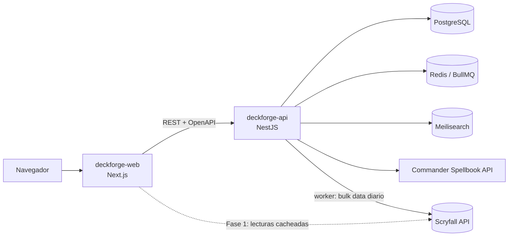

# DeckForge · Web

> **Nombre provisional.** Constructor de mazos de _Magic: The Gathering_ inspirado en Moxfield y Archidekt,
> centrado en la velocidad de edición, las animaciones fluidas y unas recomendaciones que expliquen el porqué.

**Estado:** Fase 0, esqueleto del proyecto. Este README es el **guion de desarrollo**: cada fase se marca aquí según avanza.

## Índice

1. [Visión del producto](#1-visión-del-producto)
2. [Arquitectura y repositorios](#2-arquitectura-y-repositorios)
3. [Stack tecnológico](#3-stack-tecnológico)
4. [Estructura del proyecto](#4-estructura-del-proyecto)
5. [Pantallas](#5-pantallas)
6. [APIs de Magic: The Gathering](#6-apis-de-magic-the-gathering)
7. [Roadmap por fases](#7-roadmap-por-fases)
8. [Puesta en marcha](#8-puesta-en-marcha)
9. [Convenciones](#9-convenciones)
10. [Aviso legal](#10-aviso-legal)

---

## 1. Visión del producto

Una web donde los jugadores se registran, construyen y analizan sus mazos, descubren cartas nuevas,
reciben recomendaciones y comparten sus listas con la comunidad.

### Enfoque: Commander (EDH)

Commander es el formato más jugado de Magic y en DeckForge es **ciudadano de primera**: el resto de formatos se soportan,
pero las decisiones de producto se toman pensando en Commander.

- **El comandante manda.** Cada mazo gira alrededor de una carta. Su **identidad de color** (los colores de su coste de maná
  más los que aparezcan en el texto de sus habilidades) determina qué cartas son legales en ese mazo. Por eso el comandante
  se elige **antes** que nada y, a partir de ahí, filtra todas las búsquedas y sugerencias del mazo.
- **Cien cartas y una sola copia de cada una** (salvo tierras básicas), lo que cambia por completo las estadísticas y las
  probabilidades de robo respecto a los formatos de sesenta cartas.
- **Gran parte del mazo es casi obligatoria.** Rampa, robo de cartas, remoción y ciertas tierras se repiten en la inmensa
  mayoría de listas de esos colores. Montar esa base a mano, carta por carta, es el trabajo más repetitivo y aburrido de
  construir un mazo, y es justo lo que queremos eliminar.

### Qué queremos mejorar respecto a Moxfield y Archidekt

| Área                  | Propuesta de DeckForge                                                                                                                                   |
| --------------------- | -------------------------------------------------------------------------------------------------------------------------------------------------------- |
| Edición               | Editor _keyboard-first_: paleta de comandos (`Ctrl+K`), añadir con `4 Lightning Bolt`, deshacer/rehacer y guardado automático.                           |
| Búsqueda              | Constructor visual de filtros **sincronizado** con la sintaxis de Scryfall (editas uno y se actualiza el otro).                                          |
| Versiones             | Historial del mazo con _diffs_ (qué entró y qué salió) y variantes de un mismo mazo.                                                                     |
| Análisis              | Estadísticas en vivo: curva, fuentes de color frente a requisitos, probabilidades de robo (hipergeométrica).                                             |
| Recomendación         | Sugerencias **explicadas**, combos detectados, alternativas por presupuesto y estimación del _bracket_ de Commander.                                     |
| Rendimiento           | Listas virtualizadas, UI optimista y transiciones suaves que respetan la opción "reducir movimiento".                                                    |
| Colección             | Marcar qué cartas tienes y cuáles te faltan para completar un mazo.                                                                                      |
| **Quick adds**        | Sección del editor con las cartas casi obligatorias del comandante elegido: montar la base del mazo en unos pocos clics en lugar de buscarlas una a una. |
| **Commander primero** | Elegir comandante fija la identidad de color y filtra automáticamente búsquedas, sugerencias y validación de todo el mazo.                               |

---

## 2. Arquitectura y repositorios



| Repositorio       | Estado                | Responsabilidad                                                                                                     |
| ----------------- | --------------------- | ------------------------------------------------------------------------------------------------------------------- |
| **deckforge-web** | ✅ Este repositorio   | Interfaz, SSR/SEO de mazos y cartas públicas, BFF ligero (Route Handlers que hacen de proxy cacheado a Scryfall).   |
| **deckforge-api** | ⏳ Fase 2             | Autenticación, usuarios, mazos, colección, búsqueda de mazos, recomendaciones y worker de sincronización de cartas. |
| deckforge-recs    | 💭 A evaluar (Fase 6) | Solo si el motor de recomendaciones necesita ML en Python; si no, vive como módulo de `deckforge-api`.              |

**¿Por qué separar web y API?** El worker que sincroniza los _bulk data_ de Scryfall (cientos de MB al día) y el cálculo
de recomendaciones son procesos pesados con otro ciclo de despliegue y escalado que el frontend. El contrato entre ambos
es la especificación **OpenAPI** que publica la API; el frontend genera sus tipos con `openapi-typescript`.

---

## 3. Stack tecnológico

| Capa            | Tecnología                                    |
| --------------- | --------------------------------------------- |
| Framework       | Next.js 16 (App Router, Turbopack) + React 19 |
| Lenguaje        | TypeScript 5.9 (modo estricto)                |
| Estilos         | Tailwind CSS v4 (design tokens con `@theme`)  |
| Animaciones     | Motion (antes Framer Motion)                  |
| Estado servidor | TanStack Query 5                              |
| Estado cliente  | Zustand 5                                     |
| Validación      | Zod 4                                         |
| Calidad         | ESLint 9 + Prettier (plugin de Tailwind)      |

La justificación completa y las alternativas descartadas están en **[docs/TECH_STACK.md](docs/TECH_STACK.md)**.

---

## 4. Estructura del proyecto

```text
deckforge-web/
├── docs/
│   ├── ARCHITECTURE.md          # Capas, principios SOLID aplicados, guía de animaciones
│   └── TECH_STACK.md            # Justificación de tecnologías
├── src/
│   ├── app/                     # Rutas (App Router): solo componen, sin lógica de negocio
│   │   ├── (auth)/              # login · register (layout sin navegación)
│   │   ├── (app)/               # Shell con cabecera + template con transición de página
│   │   │   ├── decks/           # Biblioteca · [deckId] vista pública · [deckId]/edit editor
│   │   │   ├── search/          # Búsqueda de cartas y mazos (?tab=cards|decks&q=)
│   │   │   ├── cards/[cardId]/  # Detalle de carta
│   │   │   ├── u/[username]/    # Perfil público
│   │   │   └── settings/        # Ajustes
│   │   ├── globals.css          # Design tokens (colores, maná, curvas de animación)
│   │   ├── layout.tsx           # Layout raíz: fuentes, metadata, providers
│   │   ├── not-found.tsx
│   │   └── page.tsx             # Landing
│   ├── components/              # UI genérica, sin conocimiento del dominio MTG
│   │   ├── layout/              # AppHeader, MainNav, PageHeader
│   │   ├── motion/              # PageTransition y futuras primitivas de animación
│   │   └── ui/                  # Button, Skeleton, EmptyState, PlaceholderPanel
│   ├── config/                  # env.ts (Zod) · routes.ts · site.ts
│   ├── features/                # Módulos de dominio (vertical slices)
│   │   ├── cards/               # types · services (contrato) · api (adaptador Scryfall)
│   │   ├── decks/               # types · services (contrato) · components · constants
│   │   ├── deck-editor/         # store (Zustand) · components
│   │   └── search/              # types · components
│   ├── lib/                     # Utilidades genéricas: http-client, cn
│   ├── providers/               # AppProviders (TanStack Query + MotionConfig)
│   └── types/                   # Tipos compartidos (Paginated)
├── .env.example
├── eslint.config.mjs
├── next.config.ts
└── package.json
```

---

## 5. Pantallas

### Mapa de rutas

| Ruta                   | Pantalla              | Descripción                                                  | Fase |
| ---------------------- | --------------------- | ------------------------------------------------------------ | ---- |
| `/`                    | Landing               | Presentación y accesos rápidos                               | 0 ✅ |
| `/login` · `/register` | Autenticación         | Email + contraseña y OAuth (Google, Discord)                 | 2    |
| `/decks`               | **Biblioteca**        | Mazos del usuario con filtros, carpetas y etiquetas          | 2    |
| `/decks/[deckId]/edit` | **Editor de mazos**   | Construcción y análisis en tiempo real                       | 3    |
| `/search`              | **Búsqueda**          | Cartas (sintaxis Scryfall) y mazos de la comunidad           | 1/5  |
| `/decks/[deckId]`      | Vista pública de mazo | Lectura, estadísticas, compartir y exportar                  | 3/5  |
| `/cards/[cardId]`      | Detalle de carta      | Oracle, impresiones, legalidades, precios, mazos que la usan | 1    |
| `/u/[username]`        | Perfil                | Mazos públicos y actividad                                   | 5    |
| `/settings`            | Ajustes               | Cuenta y preferencias                                        | 2/4  |

Todas las rutas existen ya con su **layout definitivo** y paneles `PlaceholderPanel` que indican qué va en cada zona y en qué fase.

### Pantallas esenciales

**1 · Biblioteca de mazos (`/decks`)**

- Cabecera con acciones _Nuevo mazo_ e _Importar_.
- Barra de filtros: formato, identidad de color, carpeta o etiqueta, ordenación por fecha o nombre; vista en rejilla o lista.
- Rejilla de `DeckCard` (portada con el arte del comandante o de la carta destacada, formato, número de cartas y colores).
- Estado vacío con llamada a la acción; _skeletons_ durante la carga (`loading.tsx`).

**2 · Editor de mazos (`/decks/[deckId]/edit`)**

- **Columna izquierda:** buscador con autocompletado para añadir cartas, con atajos de teclado.
- **Columna central:** zonas (comandante, principal, banquillo, quizás), agrupación por tipo, CMC o etiqueta y _drag & drop_.
- **Columna derecha:** estadísticas en vivo, validación de legalidad y recomendaciones.
- **Quick adds ("recomendado para este comandante"):** bloque destacado con las cartas casi obligatorias de esa identidad
  de color, agrupadas por función (rampa, robo, remoción, tierras) y añadibles de una en una o por paquetes completos.
  Una vez montada esa base, el mismo bloque cambia de papel y pasa a sugerir cartas según las **carencias detectadas**
  en el mazo: poca rampa para su curva, falta de robo, pocas fuentes de uno de sus colores o ninguna respuesta a encantamientos.
- Guardado automático optimista, deshacer/rehacer e historial de versiones.

**3 · Búsqueda (`/search`)**

- Pestañas _Cartas_ y _Mazos_ con el estado en la URL, de modo que las búsquedas se pueden compartir.
- Barra de consulta con ayuda de sintaxis y filtros visuales sincronizados con la consulta.
- Resultados en rejilla virtualizada con scroll infinito y vista rápida al pasar el ratón.

---

## 6. APIs de Magic: The Gathering

### Scryfall (fuente principal de datos de cartas)

Base URL: `https://api.scryfall.com` · Adaptador: `src/features/cards/api/scryfall-card-repository.ts`

| Endpoint                                       | Uso en DeckForge                                                       | Fase |
| ---------------------------------------------- | ---------------------------------------------------------------------- | ---- |
| `GET /cards/search?q=`                         | Búsqueda de cartas con sintaxis completa                               | 1    |
| `GET /cards/autocomplete?q=`                   | Autocompletado en buscador y editor                                    | 1    |
| `GET /cards/:id`                               | Detalle de una impresión concreta                                      | 1    |
| `GET /cards/named?exact=\|fuzzy=`              | Resolver nombres escritos a mano                                       | 1    |
| `GET /cards/:id/rulings`                       | Rulings en el detalle de carta                                         | 1    |
| `GET /cards/search?q=oracleid:…&unique=prints` | Todas las impresiones de una carta                                     | 1    |
| `GET /cards/search?q=id<=wub …`                | Cartas legales según la identidad de color del comandante (quick adds) | 3    |
| `GET /symbology`                               | SVG de símbolos de maná para `ManaCost`                                | 1    |
| `GET /catalog/*`                               | Listas de tipos, subtipos y _keywords_ para los filtros                | 1    |
| `GET /sets`                                    | Filtro por edición e iconos de set                                     | 1    |
| `POST /cards/collection`                       | Importar listas (hasta 75 identificadores por petición)                | 2    |
| `GET /bulk-data`                               | Sincronización diaria de la base de cartas en la API                   | 2    |

**Normas de uso que debemos cumplir:**

- Enviar siempre las cabeceras `User-Agent` (identificable) y `Accept`; Scryfall rechaza las peticiones que no las llevan.
- Como máximo unas **10 peticiones por segundo** (50–100 ms entre peticiones).
- **Cachear los datos al menos 24 h.** El navegador nunca llama a Scryfall directamente: siempre pasa por nuestro servidor.
- No ofrecer sus datos detrás de un muro de pago y respetar las normas de uso de las imágenes (sin recortar el crédito del artista).
- Revisar la documentación oficial antes de cada fase por si hay cambios: <https://scryfall.com/docs/api>.

### Otras fuentes

| Fuente                  | Uso previsto                                              | Notas                                                                      |
| ----------------------- | --------------------------------------------------------- | -------------------------------------------------------------------------- |
| **Commander Spellbook** | Detección de combos en un mazo (Fase 6)                   | API pública; confirmar endpoints y límites en su documentación.            |
| **MTGJSON**             | Histórico de precios y datos de sets en bloque (opcional) | Descargas masivas; útil para gráficas de evolución de precio.              |
| EDHREC                  | Solo como referencia de producto                          | Sin API pública oficial: **no hacer scraping**. Recomendaciones propias.   |
| Moxfield / Archidekt    | Importación de mazos                                      | Sin API pública documentada: importar por **texto** exportado (MTGA/MTGO). |
| TCGplayer / Cardmarket  | Precios                                                   | Acceso restringido: usar los precios que ya incluye Scryfall.              |

### Estrategia de datos por fases

1. **Fase 1:** el frontend consulta Scryfall **desde el servidor** (Server Components y Route Handlers) con caché de 24 h.
2. **Fase 2 en adelante:** `deckforge-api` mantiene una copia local de los _bulk data_. Las búsquedas y las recomendaciones
   usan nuestra base de datos, sin límites de peticiones y con la posibilidad de cruzar cartas con mazos.
   Gracias al contrato `CardRepository`, el cambio consiste en sustituir el adaptador y la UI no se modifica.

---

## 7. Roadmap por fases

### Fase 0 · Esqueleto ✅

- [x] Next.js 16 + TypeScript estricto + Tailwind v4 + Motion + TanStack Query + Zustand + Zod
- [x] Estructura por _features_, grupos de rutas y todas las pantallas con layout y paneles provisionales
- [x] Contratos `CardRepository` / `DeckRepository` y adaptador de Scryfall
- [x] Design tokens (colores de maná, curvas de animación) y transición de página
- [x] CI con GitHub Actions: formato, lint, tipos, tests y build en cada push y cada pull request
- [x] Tests: Vitest + Testing Library (unitarios), Playwright (E2E) y MSW para simular las APIs
- [x] Hooks de git: lint-staged antes de cada commit y commitlint (Conventional Commits)

### Fase 1 · Búsqueda y detalle de cartas (sin backend)

- [x] Route Handlers `/api/cards/search` y `/api/cards/autocomplete` como proxy cacheado a Scryfall
- [x] Hooks `useCardSearch` (infinite query) y `useCardAutocomplete` (con _debounce_)
- [x] Barra de búsqueda con autocompletado navegable por teclado
- [ ] Historial de búsquedas y ayuda de sintaxis en la propia barra
- [x] Filtros visuales ⇄ sintaxis Scryfall (parser bidireccional)
- [x] Filtro por identidad de color (`id<=`), base del filtrado por comandante de la Fase 3
- [x] Scroll infinito con IntersectionObserver, con tope de carga automática y botón de respaldo
- [ ] Rejilla virtualizada (TanStack Virtual): con varias páginas hay cientos de nodos en el DOM
- [x] Componentes `CardImage` y `ManaCost`; pendientes el giro de doble cara y los SVG oficiales
- [x] Página `/cards/[cardId]`: oracle, legalidades y precios; pendientes rulings e impresiones
- [x] Gestión de errores (`error.tsx`), estados vacíos y _skeletons_

### Fase 2 · Backend, cuentas y biblioteca

- [ ] Crear `deckforge-api` (NestJS + PostgreSQL + Drizzle + Better Auth) y worker de _bulk data_
- [ ] Generar tipos del cliente desde OpenAPI
- [ ] Registro y acceso (email + OAuth), sesión y protección de rutas con `proxy.ts`
- [ ] `HttpDeckRepository` que implemente `DeckRepository`
- [ ] Biblioteca: crear, duplicar, borrar, carpetas y etiquetas, filtros, vista rejilla/lista
- [ ] Importación de listas en texto (MTGA/MTGO) resolviendo cartas con `/cards/collection`

### Fase 3 · Editor de mazos

- [ ] Layout de tres columnas redimensionables; pestañas en móvil
- [ ] Añadir cartas con autocompletado, cantidades rápidas y paleta de comandos (`cmdk`)
- [ ] Zonas con _drag & drop_ (dnd-kit) y animaciones de reordenación
- [ ] Agrupar por tipo, CMC, color o etiqueta; vistas de texto, imágenes y pilas
- [ ] Guardado automático optimista (`useOptimistic` + cola de sincronización), deshacer/rehacer
- [ ] Estadísticas en vivo: curva de maná, colores, tipos, precio y fuentes de maná
- [ ] Validación de legalidad: tamaño, copias, identidad de color y lista de prohibidas
- [ ] Selector de comandante: fija la identidad de color y filtra el resto del editor
- [ ] **Quick adds v1:** cartas casi obligatorias de esa identidad de color, agrupadas por función
      (rampa, robo, remoción, tierras), añadibles de una en una o por paquetes completos
- [ ] Historial de versiones con _diffs_

### Fase 4 · Pulido de la experiencia

- [ ] Transiciones entre rutas con la View Transitions API (React `<ViewTransition>`)
- [ ] Tema claro/oscuro e internacionalización (es/en)
- [ ] Accesibilidad WCAG 2.2 AA y navegación completa por teclado
- [ ] PWA con consulta de mazos sin conexión
- [ ] Presupuesto de rendimiento: Lighthouse ≥ 90 y Core Web Vitals en verde

### Fase 5 · Comunidad

- [ ] Búsqueda de mazos públicos (Meilisearch), perfiles, "me gusta", comentarios y seguidores
- [ ] Compartir: enlace, imagen Open Graph generada, _embed_ y exportación (MTGA, MTGO, CSV)
- [ ] Comparador de mazos lado a lado
- [ ] _Playtester_: robar manos, mulligan y probabilidades

### Fase 6 · Recomendaciones

- [ ] Detección de combos (Commander Spellbook)
- [ ] Sugerencias por co-ocurrencia en mazos públicos (mismo comandante o arquetipo)
- [ ] Sinergias por etiquetas de función (_ramp_, _removal_, _draw_…)
- [ ] **Quick adds v2:** detección de carencias del mazo (poca rampa, poco robo, curva alta,
      fuentes de color insuficientes) y sugerencias concretas para corregirlas
- [ ] Alternativas más baratas para cada carta
- [ ] Estimación del _bracket_ de Commander
- [ ] Explicación visible del porqué de cada recomendación

---

## 8. Puesta en marcha

Requisitos: **Node.js 22.22.1 o superior** (ver `.nvmrc`); es el mínimo que exigen jsdom y lint-staged.

```bash
npm install
```

```bash
cp .env.example .env.local
```

```bash
npm run dev
```

La app queda disponible en <http://localhost:3000>.

| Script              | Descripción                                      |
| ------------------- | ------------------------------------------------ |
| `npm run dev`       | Servidor de desarrollo (Turbopack)               |
| `npm run build`     | Build de producción                              |
| `npm run start`     | Sirve el build de producción                     |
| `npm run lint`      | ESLint                                           |
| `npm run typecheck` | Genera los tipos de rutas y comprueba TypeScript |
| `npm run format`    | Formatea con Prettier                            |
| `npm run test`      | Tests unitarios en modo vigilancia (Vitest)      |
| `npm run test:run`  | Tests unitarios una sola vez (lo que usa CI)     |
| `npm run test:e2e`  | Tests de extremo a extremo (Playwright)          |

---

## 9. Convenciones

- **Rutas finas:** `src/app` solo compone componentes de `features/`; la lógica vive en los módulos de dominio.
- **Dependencias hacia dentro:** `app → features → lib/components`. `lib/` y `components/` nunca importan de `features/`.
- **Contratos antes que implementaciones:** la UI depende de `CardRepository` y `DeckRepository`, no de `fetch`.
- **Server Components por defecto:** `"use client"` solo cuando haga falta interacción, estado o animación.
- **Nombres:** ficheros en `kebab-case`, componentes en `PascalCase`, hooks `useAlgo`.
- **Git:** ramas `feat/…`, `fix/…`, `chore/…` y mensajes con [Conventional Commits](https://www.conventionalcommits.org/).

Más detalle (principios SOLID aplicados y guía de animaciones) en **[docs/ARCHITECTURE.md](docs/ARCHITECTURE.md)**.

---

## 10. Aviso legal

DeckForge es contenido de fans no oficial, permitido por la Política de Contenido de Fans de Wizards of the Coast.
No está aprobado ni respaldado por Wizards. Parte de los materiales utilizados son propiedad de Wizards of the Coast.
© Wizards of the Coast LLC. _(Antes de publicar, sustituir este texto por la redacción oficial vigente de la política.)_

Los datos y las imágenes de cartas proceden de [Scryfall](https://scryfall.com) y se usan según sus condiciones.
