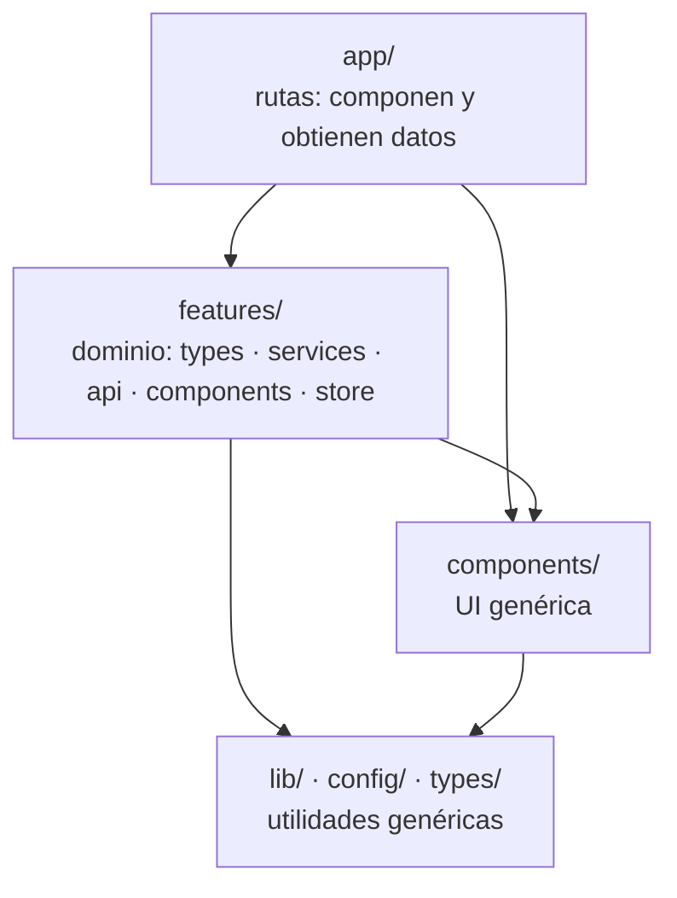
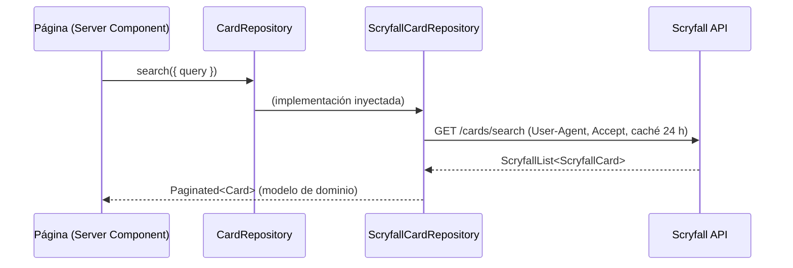

# Arquitectura del frontend

## Capas y regla de dependencias



- Las dependencias solo apuntan **hacia abajo**. `lib/` y `components/` no conocen el dominio de Magic.
- Dentro de una _feature_, los componentes dependen de los **contratos** (`services/`), no de los adaptadores (`api/`).
- Una _feature_ puede usar los **tipos** de otra (p. ej. `decks` usa `ManaColor` de `cards`), pero nunca sus componentes internos.

## Anatomía de una feature

```text
features/cards/
├── types/        # Modelo de dominio (Card, CardSearchParams…)
├── services/     # Contratos (interfaces): CardRepository
├── api/          # Adaptadores concretos: ScryfallCardRepository + tipos de la API externa
├── hooks/        # (Fase 1) useCardSearch, useCardAutocomplete
└── components/   # (Fase 1) CardImage, ManaCost, CardGrid…
```

## Principios SOLID aplicados

| Principio                        | Dónde se ve en el código                                                                                                                          |
| -------------------------------- | ------------------------------------------------------------------------------------------------------------------------------------------------- |
| **S**: responsabilidad única     | `http-client.ts` solo sabe hacer peticiones; `ScryfallCardRepository` solo traduce Scryfall al dominio; las páginas solo componen.                |
| **O**: abierto/cerrado           | `Button` admite variantes nuevas añadiendo una entrada a `variantClasses`, sin tocar su lógica.                                                   |
| **L**: sustitución de Liskov     | Cualquier implementación de `CardRepository` (Scryfall hoy, `deckforge-api` mañana, un mock en tests) es intercambiable.                          |
| **I**: segregación de interfaces | `DeckReader` y `DeckWriter` están separados: la vista pública solo necesita leer.                                                                 |
| **D**: inversión de dependencias | La UI depende de las interfaces `CardRepository` y `DeckRepository`; las implementaciones se crean en factorías (`createScryfallCardRepository`). |

## Server Components y Client Components

| Server Component (por defecto)                 | Client Component (`"use client"`)                        |
| ---------------------------------------------- | -------------------------------------------------------- |
| Obtener datos (repositorios)                   | Estado local, eventos (`onClick`, teclado)               |
| Páginas, layouts, listas estáticas             | Animaciones con Motion, `usePathname`, stores de Zustand |
| Acceso a variables privadas (`getServerEnv()`) | TanStack Query en el navegador                           |

Regla práctica: el `"use client"` se coloca **lo más abajo posible** del árbol. Por ejemplo, `AppHeader` es de servidor y
solo `MainNav`, que necesita `usePathname` y la animación, es de cliente.

## Flujo de datos



En el cliente (Fase 1), los hooks de TanStack Query llaman a Route Handlers propios (`/api/cards/*`), que usan el mismo
repositorio en el servidor. El navegador **nunca** llama directamente a Scryfall.

## Guía de animaciones

Objetivo: que la app se sienta **rápida y fluida**, nunca lenta ni recargada.

| Tipo de interacción                                  | Duración   | Técnica                                      |
| ---------------------------------------------------- | ---------- | -------------------------------------------- |
| Micro-interacciones (_hover_, pulsar un botón)       | 150–200 ms | Transiciones CSS de Tailwind + `ease-smooth` |
| Entrada de página o de panel                         | 250–350 ms | Motion (`PageTransition`)                    |
| Movimiento de elementos (pestañas, reordenar cartas) | física     | Motion `layout` / `layoutId` con _spring_    |
| Carga                                                | continuo   | `Skeleton` con _shimmer_                     |

Reglas:

1. Animar solo `transform` y `opacity` (y `filter` con cuidado); nunca `width`, `height` ni `top`, que provocan _reflow_.
2. Las entradas usan la curva `--ease-smooth` (arranque rápido y frenado suave); las salidas, más cortas que las entradas.
3. Respetar siempre `prefers-reduced-motion` (ya configurado en `globals.css` y en `MotionConfig`).
4. Una animación debe **explicar** un cambio (de dónde viene o a dónde va algo), no decorar.

## Cómo añadir una funcionalidad nueva

1. Definir o ampliar los **tipos** del dominio en `features/<feature>/types`.
2. Si hay acceso a datos, declarar o ampliar el **contrato** en `services/` y después implementarlo en `api/`.
3. Crear los **hooks** (TanStack Query) y los **componentes** de la _feature_.
4. Componer en la **ruta** de `src/app`, que debe quedar fina.
5. Añadir las rutas nuevas en `src/config/routes.ts` (nunca escribir URLs a mano).
6. Marcar la tarea en el roadmap del `README.md`.
